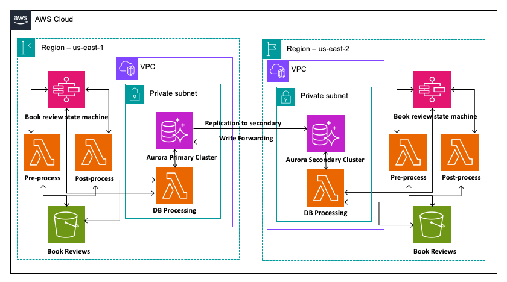

# Use Amazon Aurora Global Database to build resilient multi-Region web applications 

Building resilient multi-Region web application using Amazon Aurora Global Database with write forwarding feature.

# Solution Architecture



## Prerequisites

1. Download and install the latest version of Python for your OS from [here](https://www.python.org/downloads/). We will be using Python 3.9+.

2. You will need to install version 2 of the [AWS CLI](https://docs.aws.amazon.com/cli/latest/userguide/cli-chap-install.html) as well. If you already have AWS CLI, please upgrade to a minimum version of 2.0.5 following the instructions on the link above.

3. You will need to install AWS CDK and Node for deploying the solution.
## Deployment Instructions

This solution require some manual steps to setup Amazon Aurora Global Database
setup in two AWS regions. We will using `us-east-1` and `us-east-2' in our instructions
you can choose to use any AWS regions of your choice that supports Amazon Aurora Global Database.
Please follow the instruction in the blog to complete the database setup before deploy the application
using CDK.

1. Follow instruction in blog to complete the Amazon Aurora Global Database, AWS Secrets Manager and Security Group setup.

2. Download the contents of this repository on your local machine (into say:
   `project-directory`)

3. Change directory to layer directory to build the layer zip file
   ```bash
   cd layer/
   ./buildPySQLLayer.sh
   ```

4. Edit cdk.json to update `VpcID` with the VPC ID from your account in both the regions. 

5. Run CDK to deploy the solution in first region `us-east-1`
    ```bash
   npm update
   export AWS_REGION=us-east-1
   cdk deploy
    ```
6. Run CDK to deploy the solution in second region `us-east-2`
    ```bash
   export AWS_REGION=us-east-2
   cdk deploy
    ```

## Test Data Setup 

1. Run the below command to download the book reviews testa data from blog bucket and upload them to the S3 buckets 
    created during deployment. You have to login to cloudformation console in both regions and refer to resources 
    sections to get the bucket names. Bucket name will start with `bookreview`
    ```bash
    ./test_data_setup.sh
    ```

## Execution Instructions

Follow the instructions in blog post to test the solution.


## Further Reading:

- Blogpost: [Use Amazon Aurora Global Database to build resilient multi-Region web applications](https://aws.amazon.com/blogs/blogs/database/use-amazon-aurora-global-database-to-build-resilient-multi-region-applications/)

## License

This library is licensed under the [MIT-0 License](https://github.com/aws/mit-0).